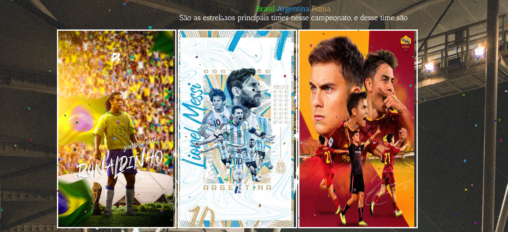

# *🏆Legue of Sports🏆*

## Sobre o Projeto 🚀
Projeto criado para aprimorar conhecimentos relacionados a HTML, CSS e JS. Legue of sports e um campeonato fictício entre seleções do Brasil, Roma e Argentina. Foram trabalhado pocionamento de imagens e efeitos.

#

## Tecnologia 💻
